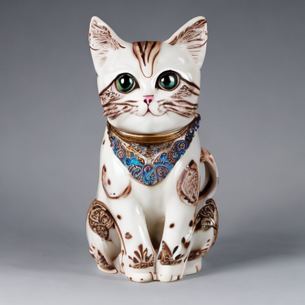
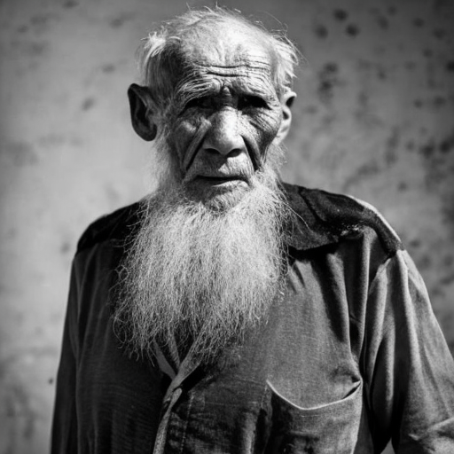
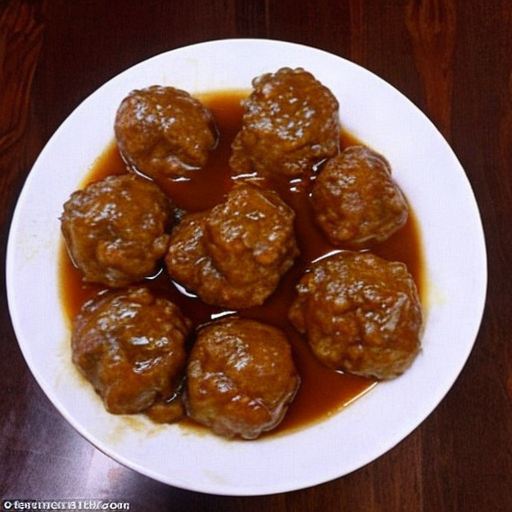
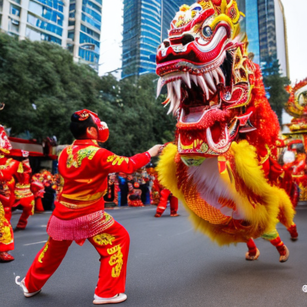
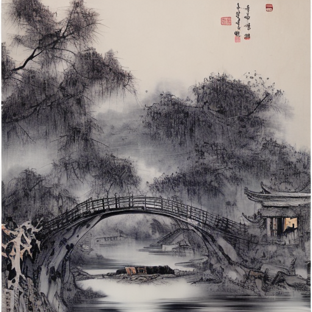

# MiaoBi-beta
这是妙笔的测试版本。妙笔，一个中文文生图模型，与经典的stable-diffusion 1.5版本拥有一致的结构，兼容现有的lora，controlnet，T2I-Adapter等主流插件及其权重。

This is the beta version of MiaoBi, a chinese text-to-image model, following the classical structure of sd-v1.5, compatible with existing mainstream plugins such as Lora, Controlnet, T2I Adapter, etc.


## Installation

1. Clone the repository

```sh
git clone https://github.com/ShineChen1024/MiaoBi.git
```

2. Create a conda environment and install the required packages

```sh
conda create -n MiaoBi-SD python==3.10
conda activate MiaoBi-SD
pip install torch==2.0.1 torchvision==0.15.2 numpy==1.25.1 diffusers==0.25.1 opencv-python==4.8.0  transformers==4.31.0 accelerate==0.21.0
```

3. Download checkpoints

download weights from [Huggingface](https://huggingface.co/ShineChen1024/MiaoBi), and put it on checkpoints folder.

## Diffusers
```py
from diffusers import StableDiffusionPipeline
from transformers import AutoTokenizer

tokenizer = AutoTokenizer.from_pretrained("checkpoints/miaobi_beta0.9/tokenizer",  trust_remote_code=True)
pipe = StableDiffusionPipeline.from_pretrained("checkpoints/miaobi_beta0.9")

pipe.to("cuda")
prompt = "一只穿着铠甲的猫"
image = pipe(prompt).images[0]
image.save("铠甲猫.png")
```

## Inference
1. python demo
```sh
python miaobi_generate.py
```

2. controlnet demo
```sh
python miaobi_controlnet.py
```


## MiaoBi-beta-v0.9 Chinese Example

一只精致的陶瓷猫咪雕像，全身绘有精美的传统花纹，眼睛仿佛会发光。 




动漫风格的风景画，有山脉、湖泊，也有繁华的小镇子，色彩鲜艳，光影效果明显。 


极具真实感的复杂农村的老人肖像，黑白。  




红烧狮子头 




车水马龙的上海街道，春节，舞龙舞狮。 




枯藤老树昏鸦，小桥流水人家。水墨画。 




## Limitations
妙笔的训练数据包含Laion-5B中的中文子集（经过清洗过滤），Midjourney相关的开源数据（将英文提示词翻译成中文），以及我们收集的一批数十万的caption数据。由于整个数据集大量缺少成语与古诗词数据，所以对成语与古诗词的理解可能存在偏差，对中国的名胜地标建筑数据的缺少以及大量的英译中数据，可能会导致出现一些对象的混乱，如果有以上较高数据质量的伙伴，希望能完善该项目，请与我们联系，我们将根据提供的数据训练全新的版本。妙笔Beta0.9在8张4090显卡上完成训练，我们正在拓展我们的机器资源来训练SDXL来获得更优的结果，敬请期待。

Due to limitations in computing power and the size of Chinese datasets, the performance of Miaobi may be inferior to commercial models at this stage. We are expanding our computing resources and collecting larger scale data, looking forward to the future performance of Miaobi.


